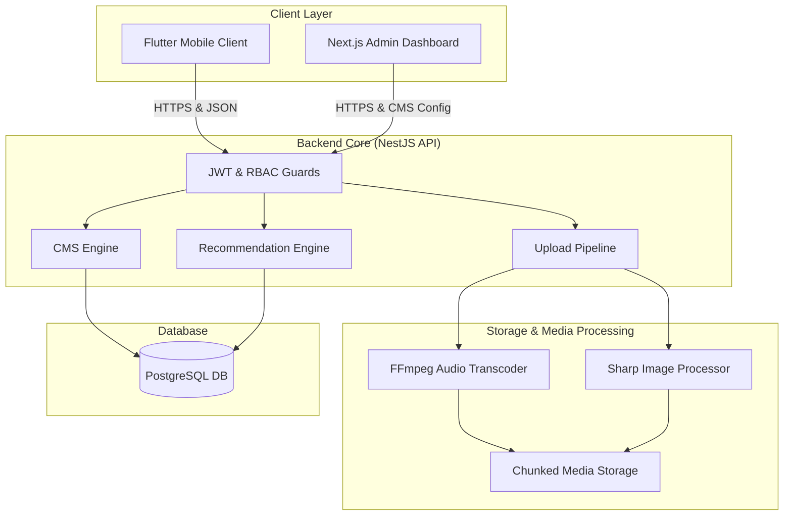

# 🪐 NEO Platform

🔗 **[Access Live Demo / Production Website](https://neo-streaming-platform.example.com)**

[](https://neo-streaming-platform.example.com)
[](https://flutter.dev)
[](https://nestjs.com)
[](https://nextjs.org)
[](https://www.postgresql.org)
[](#)

NEO is an enterprise-grade, high-performance, and fully dynamic music streaming and content distribution platform. Architected as a modern, decoupled ecosystem, NEO combines a robust modular NestJS backend, a Next.js CMS/Admin dashboard, and an optimized cross-platform Flutter mobile application.

> [!TIP]
> **Production Access:** You can access the live, deployed web application instantly at [**neo-streaming-platform.example.com**](https://neo-streaming-platform.example.com).

---

## 📖 Table of Contents

1. [Platform Architecture](#platform-architecture)
2. [Key Core Systems](#key-core-systems)
3. [Technology Stack](#technology-stack)
4. [Internal Documentation Catalog](#internal-documentation-catalog)
5. [Getting Started & Installation](#getting-started--installation)
6. [Roadmap & Development Status](#roadmap-development-status)

---

## 🪐 Platform Architecture

The NEO Platform is designed around a three-tier headless architecture:



See [ARCHITECTURE.md](./ARCHITECTURE.md) for more details on core entity layouts and runtime infrastructure.

---

## ⚡ Key Core Systems

### 1. Fully Headless CMS Engine
Unlike typical applications with hardcoded homepage components, NEO's layout is **100% API-driven**.
- **Dynamic Layout Tree**: Structured via `HomepageSection` (e.g., `HERO_BANNER`, `GRID`, `LIST`) and `HomepageItem` (e.g., references to specific Albums or Playlists).
- **Drag-and-Drop Ordering**: Persisted directly to PostgreSQL via reordering endpoints.
- **Client Render Guarantee**: The Flutter mobile client dynamically parses the CMS tree layout to render layouts at runtime, allowing zero-app-update interface overhauls.

### 2. Enterprise-Grade Upload Pipeline
Handles high-volume media ingestion safely and efficiently.
- **Chunked File Ingestion**: Large media files (audio/images) are split, uploaded incrementally, and re-assembled using `AbortController` support (allowing pause/resume).
- **Asynchronous Task Hook Simulation**: Simulates enterprise message queues (e.g., BullMQ) in-memory for background media tasks.
- **Audio Processing**: Leverages `fluent-ffmpeg` to parse audio metadata, transcode previews, and extract graphical waveforms (`waveformUrl`).
- **Image Optimization**: Leverages `sharp` to resize and compress album art and artist portraits down to web-optimized formats.

### 3. Content-Based Recommendation Engine
Provides personalized discovery with administrative control.
- **Weight-Based Scoring**: Recommends songs by calculating metadata similarities (genre tags, artist mappings) driven by live weight sliders.
- **Null Safety**: Gracefully falls back to trending/popular lists if metadata is incomplete, preventing empty user feeds.

### 4. Search Telemetry & Analytics
Tracks user queries and system usage for content discovery optimization.
- **Search Query Analysis**: Categorizes search hits, tracks high-frequency terms, and records zero-result queries to identify content gaps.
- **System Telemetry**: Computes storage consumption in real-time, displaying historical trailing activity trends via animated dashboard charts.

---

## 🛠️ Technology Stack

### 🔹 Backend Core (API)
- **Framework**: NestJS (TypeScript, Node.js)
- **Database ORM**: TypeORM (PostgreSQL)
- **Security**: JWT Rotation (Access + Refresh tokens) & RBAC Guard structures (`SUPER_ADMIN`, `ADMIN`, `NORMAL_USER`)
- **Media Engine**: FFmpeg, Sharp, Multer (safe file filters)

### 🔹 Admin Dashboard (CMS)
- **Framework**: Next.js (React)
- **Styling**: Tailwind CSS
- **Design System**: NeoTheme (Glassmorphism & dark-mode aesthetic)

### 🔹 Mobile Client
- **Framework**: Flutter & Dart (configured in [pubspec.yaml](./pubspec.yaml))
- **Networking**: `dio` (configured with automated `AuthInterceptor` & JWT Refresh pipeline)
- **Secure Storage**: `flutter_secure_storage` for credentials and auth token rotation
- **State Management**: `provider` for structured dependency injection and reactive state updating
- **Audio Engine**: `just_audio` and `audio_session` for advanced media playback management

---

## 🗃️ Internal Documentation Catalog

For deep-dive topics, consult our internal architectural tracking sheets:

| Document | Target Area & Description |
| :--- | :--- |
| 🏗️ [ARCHITECTURE.md](./ARCHITECTURE.md) | High-level system topology, module descriptions, and chunked upload pipelines. |
| 🔌 [API_DOCUMENTATION.md](./API_DOCUMENTATION.md) | REST Endpoint registry spanning CMS Homepage, Upload Center, Playlists, and Unified Search. |
| 🗄️ [DATABASE_SCHEMA.md](./DATABASE_SCHEMA.md) | Tables, relationships, junction matrices, and analytics schema (PostgreSQL representation). |
| 🛣️ [ROADMAP.md](./ROADMAP.md) | Phase 1 backend completion tracker & Phase 2 Flutter Client milestone tracker. |
| 🚦 [TESTING.md](./TESTING.md) | Runtime validation logs, build compilation metrics, and edge-case verification notes. |
| 🔒 [SECURITY.md](./SECURITY.md) | Authentication middleware design, RBAC guard flow, and file upload mitigation protocols. |
| 📈 [PERFORMANCE.md](./PERFORMANCE.md) | Identifies runtime bottlenecks (e.g. event loop blocking in recommendations) and mitigation strategies. |
| 🛠️ [TECH_DEBT.md](./TECH_DEBT.md) | Lists prioritised engineering improvements (e.g. replacing `synchronize: true` TypeORM configuration). |
| 🏷️ [RELEASE_NOTES.md](./RELEASE_NOTES.md) & [CHANGELOG.md](./CHANGELOG.md) | Archive of feature additions, engine updates, and release tracking. |

---

## 🚀 Getting Started & Installation

### Prerequisites
- [Flutter SDK](https://docs.flutter.dev/get-started/install) (>= 3.44.0)
- [Node.js](https://nodejs.org/) (>= 18.x) & `npm`
- [PostgreSQL](https://www.postgresql.org/) (>= 15.x)
- [FFmpeg](https://ffmpeg.org/download.html) installed and added to your system's `PATH`.

> [!NOTE]
> Please check the respective `README.md` files inside the `/backend` and `/admin-dashboard` directories for detailed database configuration patterns, environment variable schemas, and troubleshooting guidelines.

> [!IMPORTANT]
> The Flutter client is currently in active development (Phase 2). Running `flutter run` will attempt to connect to the backend server. Refer to [ROADMAP.md](./ROADMAP.md) for the completion status of the playback engine and search services.

---

### 1. Backend API (NestJS)

1. Navigate to the backend directory and install dependencies:
   ```bash
   cd backend
   npm install
   ```
2. Configure your environment variables by copying the template:
   ```bash
   cp .env.example .env
   ```
   *(Configure database connection strings, JWT secrets, and port configurations within `.env`)*
3. Start the application in development mode:
   ```bash
   npm run start:dev
   ```

---

### 2. Admin Dashboard (Next.js)

1. Navigate to the frontend admin folder and install dependencies:
   ```bash
   cd admin-dashboard
   npm install
   ```
2. Configure your environment variables by copying the template:
   ```bash
   cp .env.example .env.local
   ```
   *(Ensure it points to the NestJS API, default: `http://localhost:3000/api/v1`)*
3. Start the hot-reloading development server:
   ```bash
   npm run dev
   ```

---

### 3. Mobile Client (Flutter)

1. Ensure your Flutter environment is correctly configured:
   ```bash
   flutter doctor
   ```
2. Fetch package dependencies declared in [pubspec.yaml](./pubspec.yaml):
   ```bash
   flutter pub get
   ```
3. Set up the target server URL inside the configuration files, then run the app on your emulator or connected device:
   ```bash
   flutter run
   ```

---

## 🗺️ Roadmap & Development Status

For a complete breakdown of current progress and future engineering targets, see [ROADMAP.md](./ROADMAP.md).

### Current Milestones (Phase 2):
- [x] Set up robust API Network layer (`ApiClient` + `Dio` + token refresh pipeline).
- [x] Set up Authentication flow integration.
- [x] Configure Headless Homepage parser and home UI list bindings.
- [ ] Implement audio playback engine (`just_audio`).
- [ ] Design search UI overlay and search telemetry integrations.
- [ ] Add offline playback caching and local track database synchronization.
